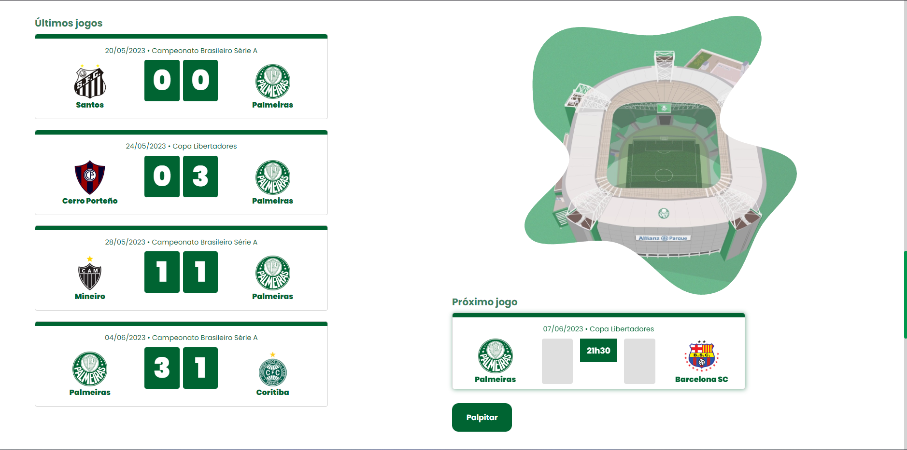
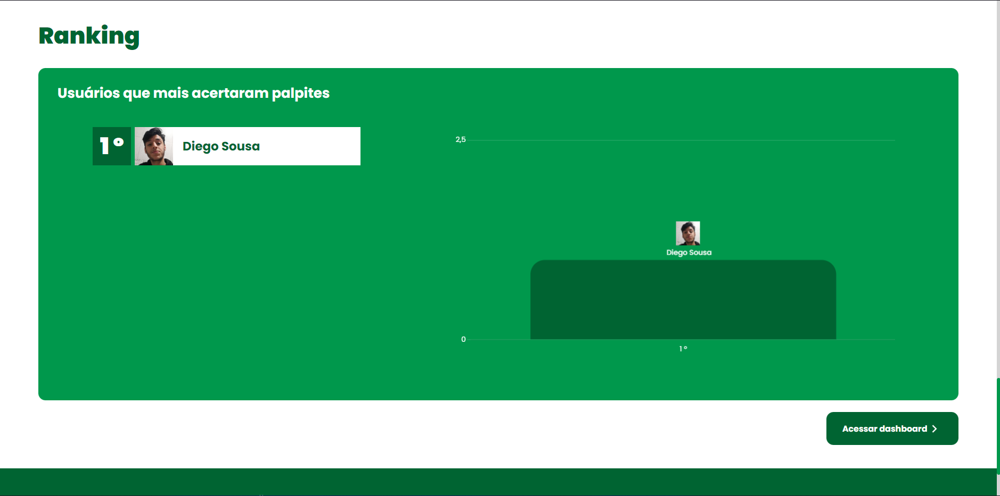
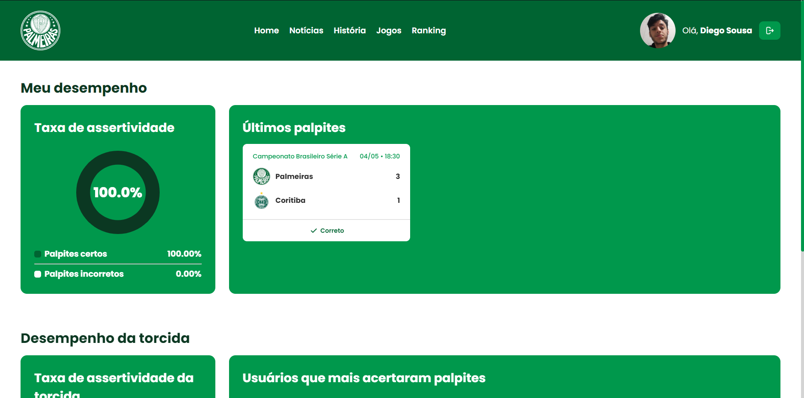

<p align="center">
    
    <p align="center">O website Torcida Palmeiras tem como objetivo promover uma maior proximidade entre os torcedores e o clube, além de possibilitar uma maior interação da torcida entre si⚽</p>
</p>

<h1 align="center">📌 Tabela de conteúdos<h2>
<p align="center">
    <a href="#computer-projeto">• Projeto</a>
    <a href="#camera-demonstração">• Demonstração</a>
    <a href="#hammer_and_wrench-tecnologias">• Tecnologias</a>
    <a href="#link-pré-requisitos">• Pré-Requisitos</a>
    <a href="#technologist-instalação">• Instalação</a>
</p>

<h4 align="center"> 
	✅  Torcida Palmeiras 🚀 Finalizado  ✅
</h4>

## :computer: **Projeto**
O site Torcida Palmeiras é o meu projeto individual do primeiro semestre de Análise e Desenvolvimento de Sistemas na faculdade São Paulo Tech School! 

## :camera: **Demonstração**

<p align="center">
    
    
    
    
    
    
</p>

## :link: **Pré-Requisitos**
Antes de começar, é necessário ter o <a href="https://nodejs.org/pt-br">Node Js</a> instalado em sua máquina, além disso, é interessante ter um bom editor de código para trabalhar, como o <a href="https://code.visualstudio.com/Download">VSCODE</a>.

## :technologist: **Instalação**
1. Clonar repositório
2. Abrir o VSCODE com o repositório
3. Abrir o terminal do VSCODE ou abrir o cmd dentro do repositório
4. Execute os comandos abaixo
```sh
# Instalar todas as dependências do projeto
npm install
```
```sh
# Executar a aplicação
npm start
```
5. Abra o servidor local(localhost) exibido no terminal

Todos os tipos de contribuições são muito bem-vindos e apreciados!
- ⭐️ Favoritar o projeto!
- 🐛 Encontrar e relatar problemas!

Feito por DiegoSousa-11 👋 <a href="https://www.linkedin.com/in/diego-sousa-28003b209/">Entre em contato!</a>
